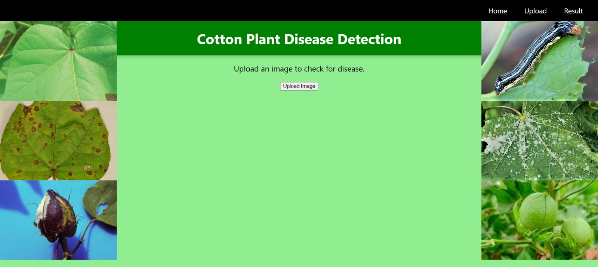
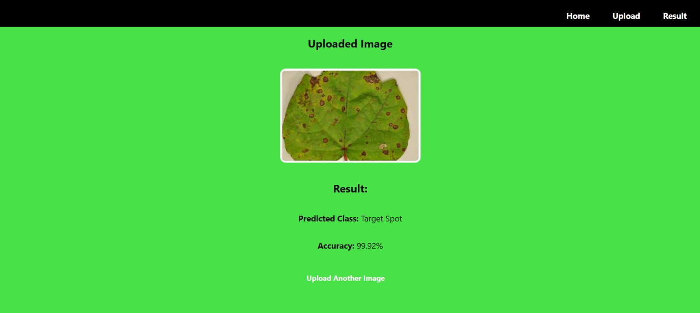

# Cotton Plant Disease Detection 🌿

This project uses deep learning techniques to identify and classify diseases in cotton plants based on images of their leaves.

##  About the Project
- Built using Convolutional Neural Networks (CNN)
- Trained on a cotton leaf image dataset
- Detects multiple cotton plant diseases
- Goal: To help farmers and agricultural experts monitor crop health and improve yields.

## Tech Stack
- Python, Flask 
- TensorFlow
- OpenCV
- HTML, CSS, JavaScript (Frontend)

## Files
- cotton_disease_model.h5 – Trained deep learning model
- app.py – Backend integration
- index.html, upload.html, result.html, result.css, upload.css,style.css, etc. – Frontend files

## How to Use
1. Upload a cotton leaf image.
2. The model predicts the disease.
3. Displays the result with an Accuracy score.

##  Sample Prediction
  
  
  
  
  

##  Contributions
Open to ideas and improvements! Pull requests welcome.

